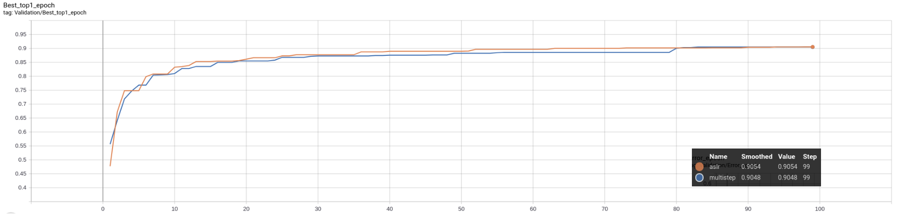

# ASLR

This repository includes code for Adaptive Scheduler for Learning Rate [ASLR](link to arxiv).

ASLR is a learning rate scheduler that adjusts the learning rate after each epoch using validation error. During each epoch, at each step, ASLR provides a _lr_ to _optimizer_ by sampling a uniform distribution around the current _lr_.

You can run  _launcher.py_ to compare ASLR with an other scheduler.

Results for ResNet20+CIFAR10:

